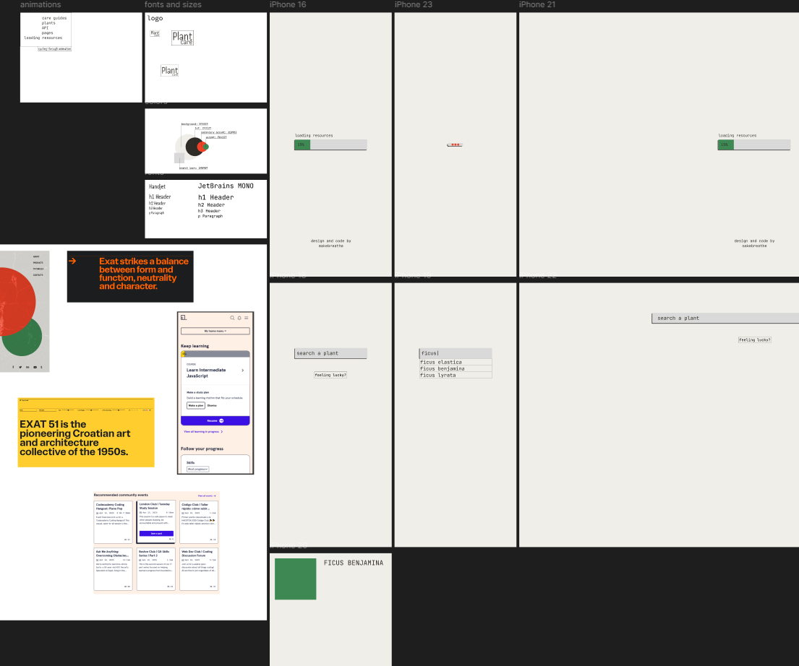

# [ *another* ] PlantApp

---

I am a proud plant dad with lots of experience, but I don't always know what certain plants require.
I have tried a lot of different plant apps, and all of them have a ton of unnecessary functions and ads, which makes
the life of a user miserable. I wanted to make something very specific, something that would finally help me and my
fellow plant parents.

Here is the design so far. It is pretty raw at the moment, and it is evolving as I go. I chose some base colors, including
background color, main color, first accent color, and a second one. The design was inspired by Codecademy, with some elements
that I used in my previous works. I decided to go with minimal and clean (cause there's no time to play around with colors
and shapes).

## I have separated the desired functionality according to the MOSCOW rule

#### Must-have:

- Fetches data from a plant API and renders the output on a separate page
- Features loading animations
- Renders error messages for users
- LOOKS GOOD

#### Should-have:

- Loading animation on initialization
- Showing search suggestions and features, with a user-friendly logic behind it
- Renders images and has nice visuals for the plant page

#### Could-have:

- 'Feeling lucky?' button functionality, where it fetches data and randomly chooses a plant from the database
- Smooth animations and amazing UI
- About page with extra info and links
- Hardness map
- Simple yet informative plant page (card style)
- Filtering options for pet-friendly plants, indoor/outdoor (though, then I will have to make another page that renders results (which I was not planning to do...))
